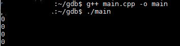

# gdbLearning

Learning to use gdb in linux machine....  

First I wrote a code that declares an integer array of 4 elements. I print out the elements but I do not free/delete the array.    
  
Compiling and running works fine. Following is the code  
  
```c  
#include <iostream>  
#include <cstdlib>  
  
using namespace std;  
  
int main()  
{  
int *arr = (int*)malloc(4*sizeof(int));  
  
for(int i=0;i<4;i++)  
cout<<arr[i]<<" "<<endl;  
  
}  
```  
Following is how it look when I compile and run.    


